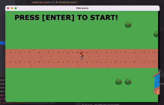

# One Piece

## Build The Game

Setup instructions: 
* Pre-Requisites:
* Java JDK 8 or later
* Git installed (Install via git-scm.com)
* IntelliJ installed is a bonus 

Open terminal and clone the git repository by running:
* $ git clone https://github.com/eric-chan/OnePiece.git

To build the maven program:
* mvn package
## Running The Game

Run the maven program with:
* mvn exec:java -Dexec.mainClass="com.group17.app.App"

If above does not work, right click the JAR file and run it in IntelliJ.

Can also be manually run by running the JAR file in IntelliJ. 
## Running Tests

To run Unit tests:
* mvn tests

To run Integration tests:
* mvn failsafe:integration-test

To run Unit and Integration tests:
* mvn verify
## Creating Javadocs

To create Javadocs:
* mvn javadoc:javadoc

The Javadocs will be found in The Javadocs are found in `${basedir}/target/site/apidocs/` if the above command is executed.
